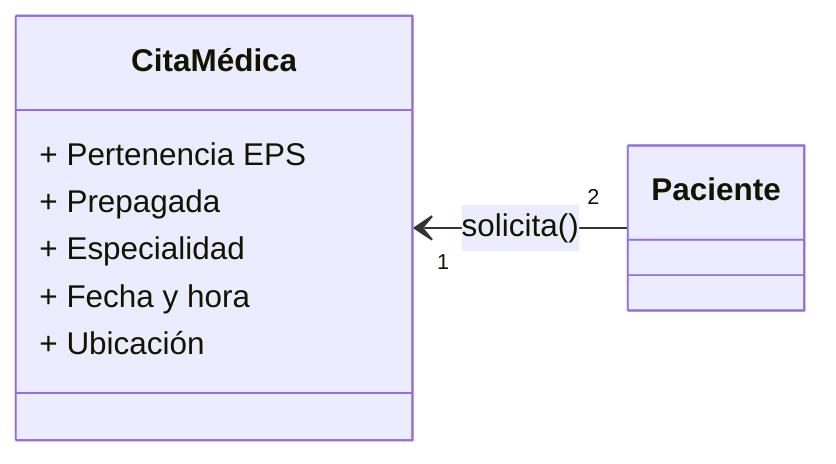
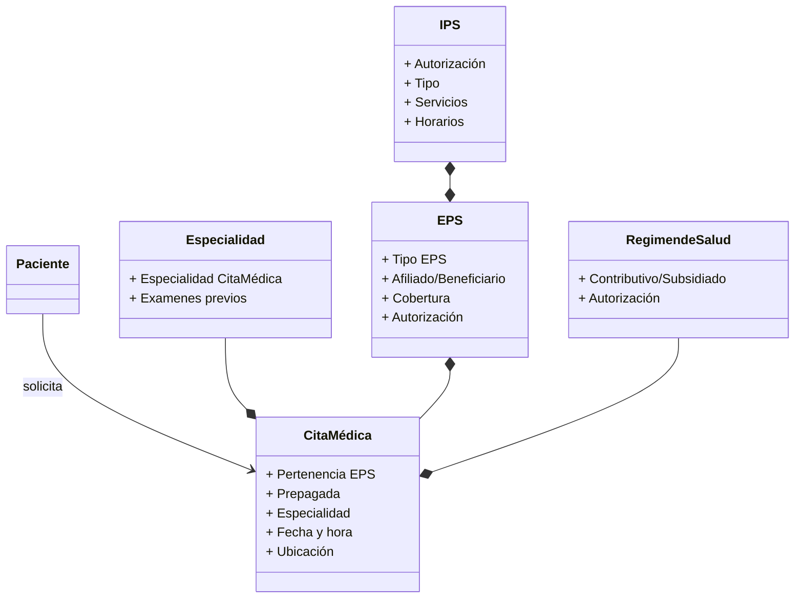

# Reto2_POO_ServicioMedico

 ### **Fecha:** 19-02-2024

**1.** Relación paciente - cita médica


```mermaid
classDiagram
    direction RL
    class CitaMédica{
        + Pertenencia EPS
        + Prepagada
        + Especialidad
        + Fecha y hora
        + Ubicación
    }
    class Paciente{
        
    }
    Paciente"2" --> "1" CitaMédica : solicita()
```

**2.** Relación paciente - cita médica


```mermaid
classDiagram
    class Paciente{    
    }
    class CitaMédica{
        + Pertenencia EPS
        + Prepagada
        + Especialidad
        + Fecha y hora
        + Ubicación
    }
    class Especialidad{
        + Especialidad CitaMédica
        + Examenes previos
    }
    class EPS{
        + Tipo EPS
        + Afiliado/Beneficiario
        + Cobertura
        + Autorización
    }
    class IPS{
        + Autorización
        + Tipo
        + Servicios
        + Horarios
    }
    class Regimen de Salud{
        + Contributivo/Subsidiado
        + Autorización
    }
    Paciente --> CitaMédica : solicita
    Especialidad --* CitaMédica 
    IPS *--*  EPS 
    EPS *--  CitaMédica 
    Regimen de Salud --* CitaMédica 
```

**3.** Relaciones entre piezas

```mermaid

```
