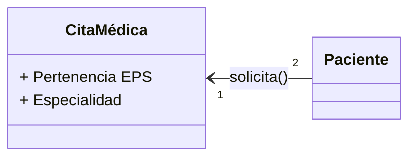

# Reto2_POO_ServicioMedico

 ### **Fecha:** 19-02-2024

**1.** Relación paciente - cita médica



**2.** Relación paciente - cita médica

```mermaid

```

**3.** Relaciones entre piezas

```mermaid

```
